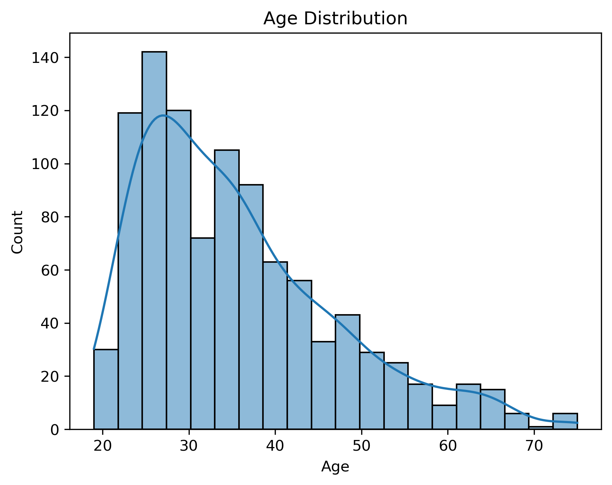
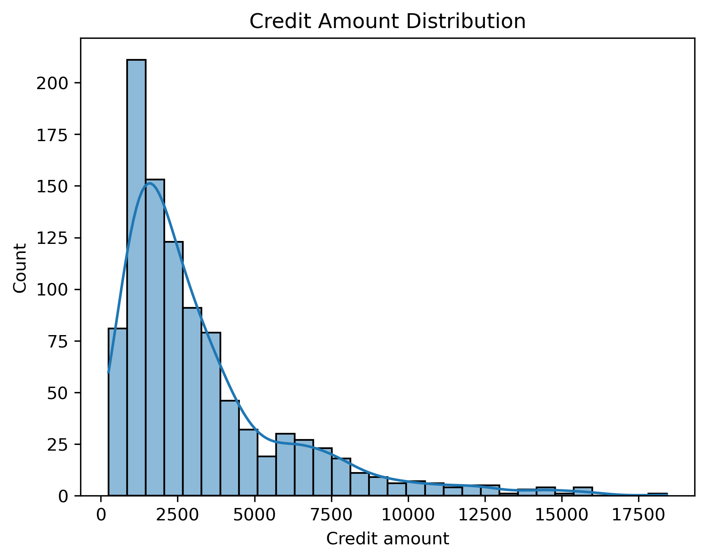
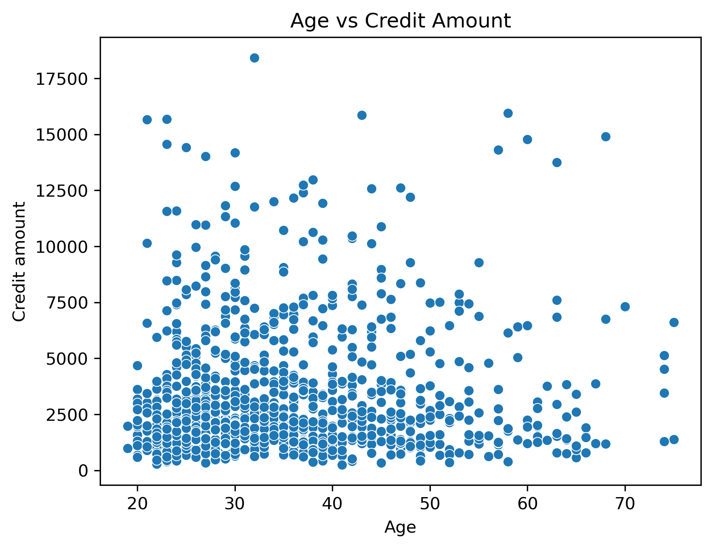
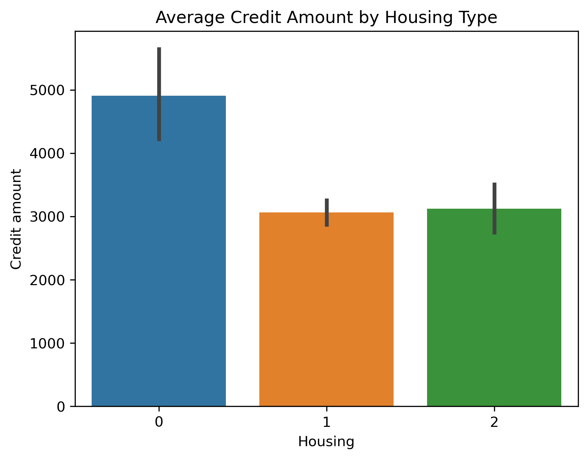
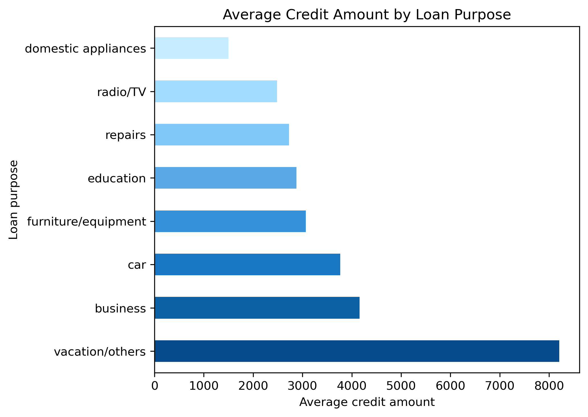
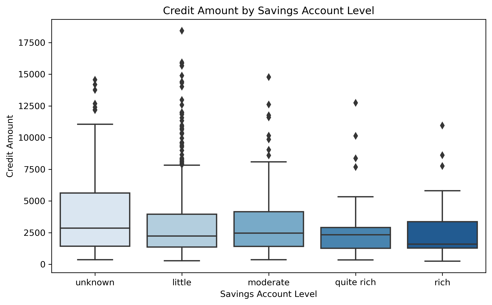
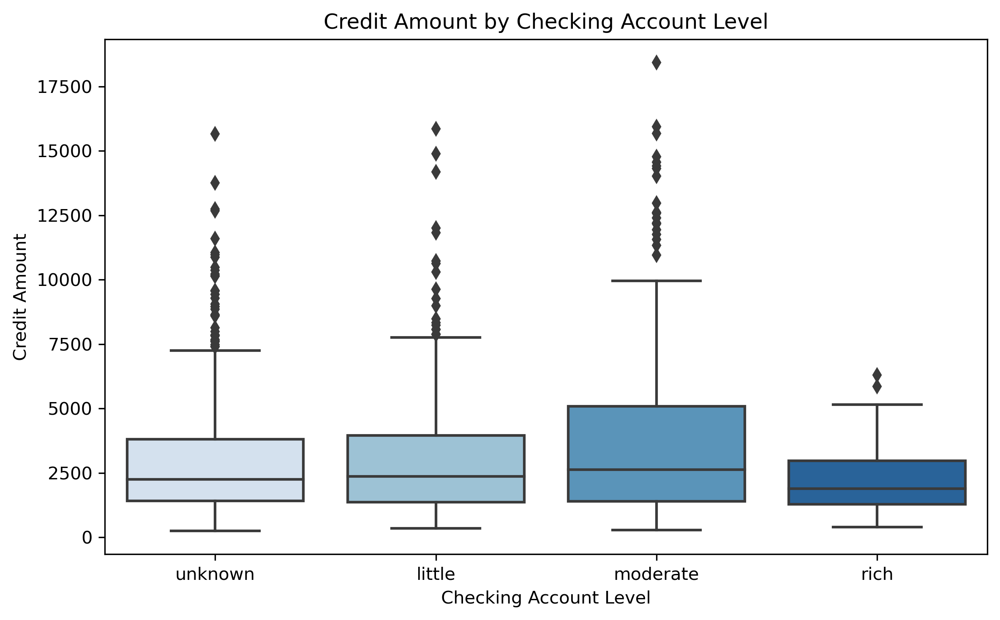
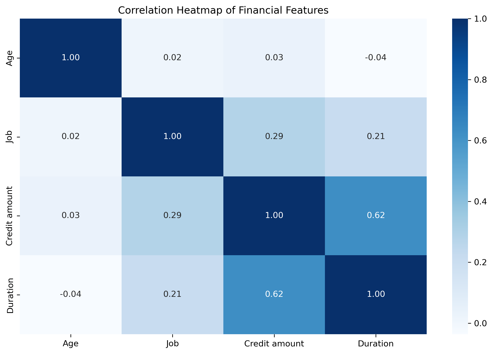
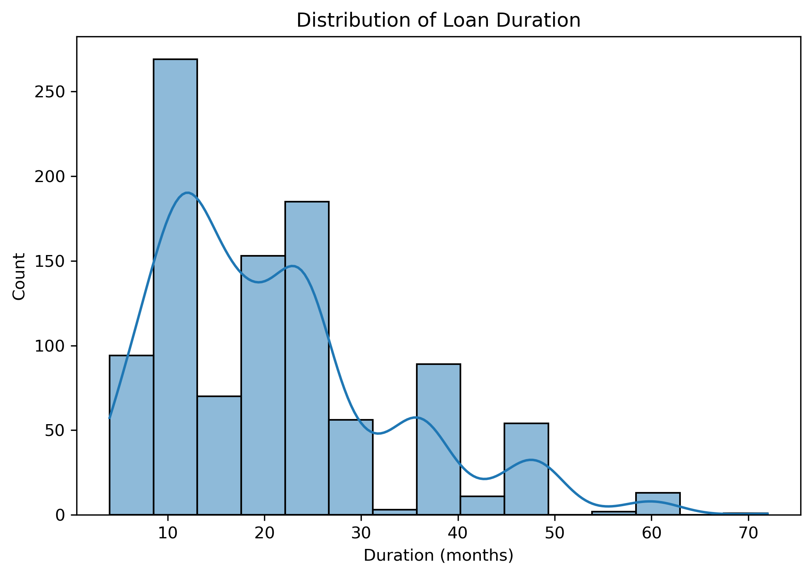

# German Credit Data – Exploratory Financial Analysis

This project explores the German Credit dataset and examines how age, financial account status, housing type, and loan purpose relate to credit amounts.  
The goal is to practice data cleaning, visualization, and simple clustering in Python.

All code is in **`src/financial_analysis.py`**.

---

## Project Structure

german-credit-analysis/
│
├── README.md
│
├── src/
│ └── financial_analysis.py
│
├── data/
│ └── german_credit_data.csv
│
└── images/
├── age_credit_distribution.png
├── age_distribution.png
├── average_credit_amount_by_housing.png
├── average_credit_amount_by_loan_purpose.png
├── correlation_heatmap.png
├── credit_amount_by_checking_account_level.png
├── credit_amount_by_savings_account_level.png
├── credit_amount_distribution.png
├── customer_clusters_based_on_age_and_credit.png
└── loan_duration_distribution.png


---

## Dataset Overview

The dataset includes 1,000 customers and contains:

- Age  
- Sex  
- Job  
- Housing type  
- Savings account level  
- Checking account level  
- Credit amount  
- Loan duration  
- Loan purpose  

I focused on understanding how these variables behave and how they relate to credit usage.

---

## Key Questions

1. What does the age distribution look like?
2. How are credit amounts distributed?
3. Do housing, savings, and checking account levels influence credit amount?
4. Which loan purposes involve the largest loans?
5. Which variables correlate most with credit amount?
6. Can we identify customer groups through clustering?

---

## Data Preparation Summary

- Loaded data from `data/german_credit_data.csv`
- Filled missing values in savings and checking account columns
- Encoded categorical variables using LabelEncoder
- Restored the original text labels for:
  - Saving accounts  
  - Checking account  
  - Purpose  
- Converted relevant columns to `category` for plotting

Full details are in the code file.

---

# Visual Analysis

---

## **Age Distribution**
Most clients are between 25 and 40 years old.

<p align="center">
  
</p>

---

## **Credit Amount Distribution**
Credit amounts are heavily right-skewed with many small loans and a few very large ones.

<p align="center">
  
</p>

---

## **Age vs Credit Amount**
Borrowers of all ages take both small and medium-sized loans. The highest amounts tend to occur in mid-adulthood.

<p align="center">
  
</p>

---

## **Average Credit Amount by Housing Type**
Homeowners take noticeably larger loans on average.

<p align="center">
  
</p>
---

## **Average Credit Amount by Loan Purpose**
Loan purpose strongly affects loan size.  
Vacation/others and business loans are the largest on average.

<p align="center">
  
</p>

---

## **Credit Amount by Savings Account Level**
Borrowers with **unknown** or **little** savings take the highest and most variable loans.

<p align="center">
  
</p>

---

## **Credit Amount by Checking Account Level**
A similar trend: borrowers with unknown checking balances tend to take higher loans.

<p align="center">
  
</p>

---

## **Correlation Heatmap**
The strongest relationship is between **Duration** and **Credit amount** — longer durations correspond to larger loans.

<p align="center">
  
</p>

---

## **Loan Duration Distribution**
Loan durations commonly fall around 12, 24, and 36 months.

<p align="center">
  
</p>

---

# Customer Segmentation (K-Means Clustering)

Clustering was performed using:
- Age  
- Credit amount  
- Duration  

After standardization, three clear clusters emerged:

<p align="center">
  
</p>

### Interpretation:

| Cluster | Description |
|--------|-------------|
| **0** | Younger clients, mostly small loans |
| **1** | Older clients with medium loans |
| **2** | High-loan borrowers, wide age range |

---

# How to Run the Project

Install dependencies:

```bash
pip install pandas numpy seaborn matplotlib scikit-learn
```

Run the script:

```bash
python src/financial_analysis.py
```

---

## Author

**Emre Aksu**

[](https://github.com/emreaksua)
[](https://www.linkedin.com/in/emreaksuecon/)

---


